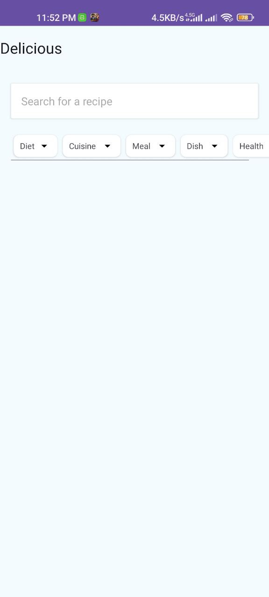
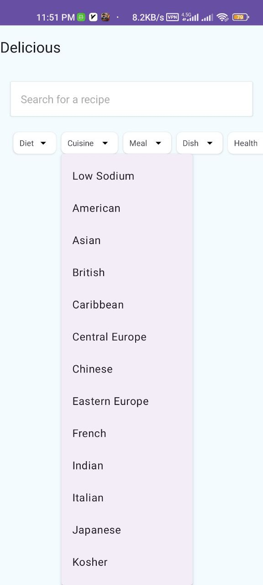
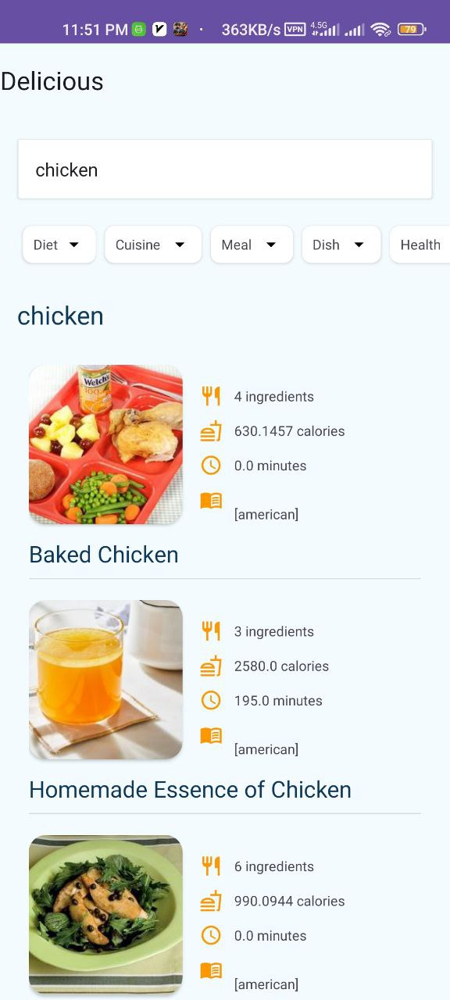
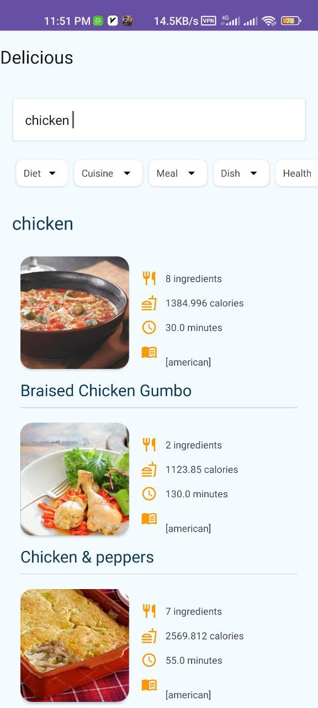

# Food Recipe

Discover a world of delicious recipes tailored to your preferences with the Recipe Explorer app. This Android Kotlin application offers a diverse range of filters, allowing users to find the perfect dish based on dietary needs, preparation time, and serving size. From low-fiber and high-protein to low-fat options, the app provides over 40 filters to customize your recipe search.

## Features

- **Advanced Filters:** Tailor your recipe search with filters such as low-fiber, high-protein, low-fat, desserts, appetizers, and more.
- **Search:** Find recipes quickly by entering specific keywords.
- **Detailed Information:** View cooking time, serving size, and other relevant details for each recipe.

## Installation and Execution

[Download APK](https://raw.githubusercontent.com/vakiliali79/Food-Recipe-Android/master/food-recipe.apk)

To install and run the Recipe Explorer app, follow these steps:


1. Clone the project:
   ```bash
   git clone https://github.com/vakiliali79/food-recipe-Android.git
   ```

2. Open the project in Android Studio.

3. Run the application on an Android emulator or a physical device.

## Usage

1. Open the app.
2. Select your desired filters or enter keywords in the search bar.
3. Browse through a variety of recipes matching your criteria.
4. Click on a recipe to view detailed instructions.

## Technologies Used

- Kotlin
- Android Studio

## Screenshots:

- **Screenshot 1**:

  

- **Screenshot 2**:

  

- **Screenshot 3**:

  

- **Screenshot 4**:

  
